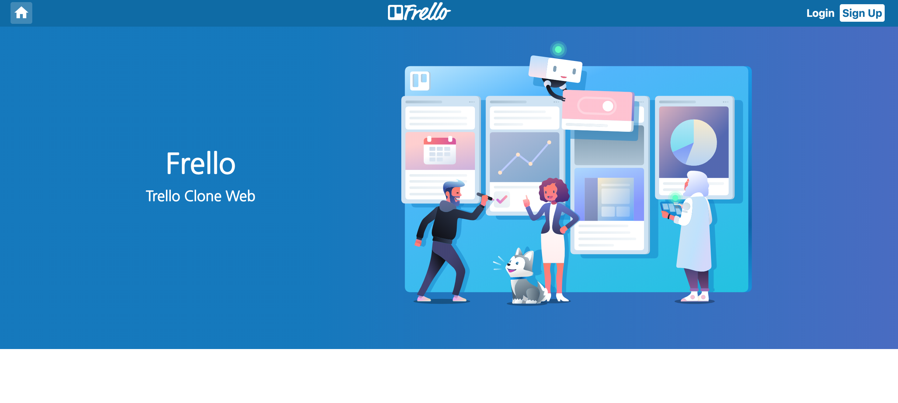
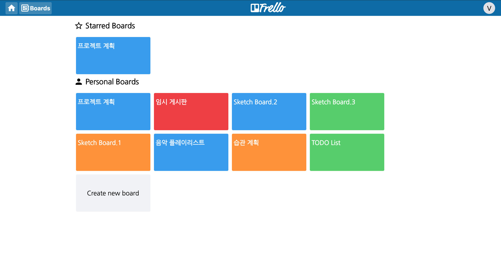
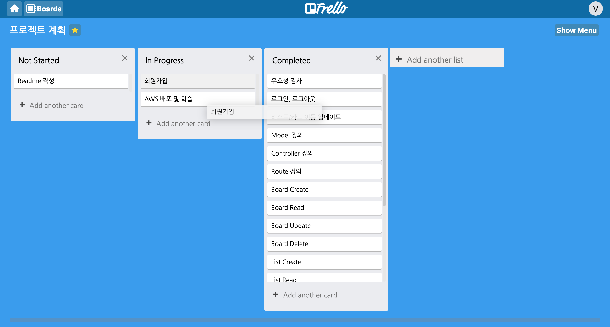
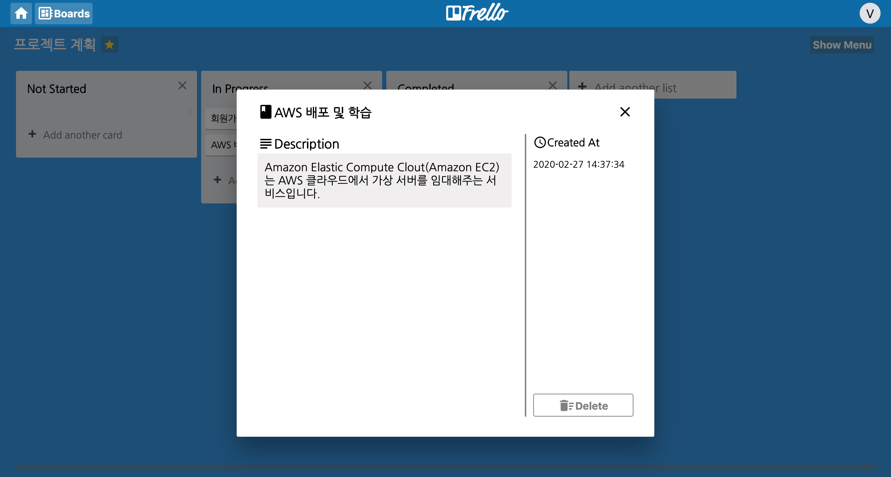

# Frello Client
http://www.frello.site/  
Test ID : VIP@gmail.com  
Test PW : 123vip

## Screenshot
  

## Built with
Vue.js, Vuex, vue-router,  
axios, Sass, drag & drop api,  

## Keyword
**Front**
- Axios로 백엔드와 RESTful API 통신
- Drag & Drop api를 사용하여 엘리먼트의 움직임에 따른 데이터 전송 및 저장 구현
- Vuex를 사용하여 상태관리

[**Back**](https://github.com/afterup/Frello_api)
- JWT와 Passport.js로 사용자 인증 및 회원가입, 로그인 기능 구현
- Sequelize를 사용하여 관계형 데이터베이스 관계 매핑
- REST API를 구축하여 프론트와 백엔드 연결
- AWS EC2, Route 53, Elastic IP를 활용하여 웹 배포